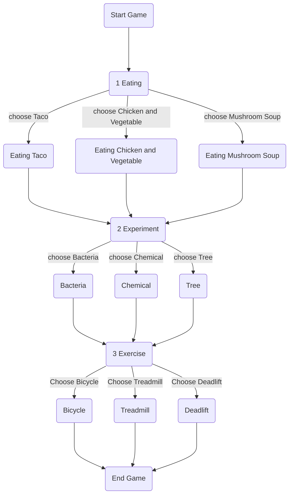

# ISS-Project

# Game Design Document

## Introduction

- Game Concept เป็นเกมPuzzle ที่เล่าเรื่องราวผ่านตัวละครเป็นมุมมองบุคคลที่1
- หมวดหมู่เกม Puzzle
- เนื้อเรื่อง 
- บรรยายกาศของเกม จะเป็นธีมอวกาศ

## Game Structure

- โหมดเกมที่ผู้เล่นสามารถเล่นได้ โหมดเนื้อเรื่องเท่านั้น
- Engagement เราผ่าน website
- การเล่น เป็นเกมเล่นคนเดียว
- วิธีการเล่น point and click แก้ Puzzle

## Graphics & Sound

- มุมมองของเกม เป็นบุคคลที่ 1
- สไตล์กราฟฟิก เป็นกราฟฟิกภาพวาด
- Animation อาจมีเล็กน้อย เช่นเดินทางเปลี่ยนโซน
- Music ถ้าใส่มาได้ก็จะมี

## Platform

- Web-based

## Development System

- Visual Studio Code

## Game play

- Character 
- Story 
- Objective 
- Core Game Mechanic 
- Level Design map 
- Progression 
- Game Flow 
- UI Flow

# ห้องต่าง ๆ

- ห้องนอน
    - จุดเริ่มต้น
- ห้องอาหาร
    - ทาโก้ แบบ Cooking Mama any% Style
    - ไก่และผัก
    - ซุปเห็ด
- ห้องออกกำลังกาย
    - ปั่นจักรยาน กดแบบ dead by lightday
    - ลู่วิ่ง กดให้อยู่ในแถบ
    - ยกน้ำหนัก กดปุ่ม
- ห้องทดลอง
    - ส่องแบคทีเรีย ปรับโฟกัสกล้อง
    - หยอดสารเคมี water jug puzzle
    - รถน้ำต้นไม้ 1.ต่อท่อน้ำให้ถึงจุดหมาย 2.เข็มฉีดน้ำให้โดนถูกจุด

[Figma Mockup Design](https://www.figma.com/file/naEJtMEKg3ZsUoGjgdbYcC/ISS?node-id=0%3A1)

